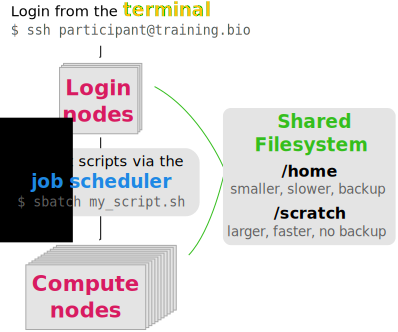

# Introduction to High Performance Computing

:::note
These materials have accompanying slides:
[Introduction to HPC slides](https://docs.google.com/presentation/d/1KmnSznETddQdRYa6UAXtT-eMOsW7tEwbsOh0fK62c84/edit?usp=sharing)
:::

:::highlight
#### Questions

- What is a HPC and how does it differ from a regular computer?
- What can a HPC be used for?

#### Learning Objectives

- Describe how a typical HPC is organised: _nodes_, _job scheduler_ and _filesystem_.
- Distinguish the roles of a _login node_ and a _compute node_.
- Describe the role of a _job scheduler_.
- Understand the difference between "scratch" and "home" storage.
:::

## What is a HPC and what are its uses?

HPC stands for **high-performance computing** and usually refers to several computers connected together in a network (forming a **HPC cluster**). 
Each of these computers is referred to as a **node** in the network. 

The main usage of HPC clusters is to run resource-intensive and/or parallel tasks.
For example: running thousands of simulations, each one taking several hours; assembling a genome from sequencing data, which requires computations on large volumes of data in memory. 
These tasks would be extremely challenging to complete on a regular computer. 
However, they are just the kind of task that a HPC would excel at. 

:::note
**Terminology Alert!**

The terms _HPC_ and _cluster_ are often used interchangeably to mean the same thing. 
:::

When working on a HPC it is important to understand what kinds of _resources_ are available to us. 
These are the main resources we need to consider:

- **CPU** (central processing units) is the "brain" of the computer, performing a wide range of operations and calculations. 
CPUs can have several "cores", which means they can run tasks in parallel, increasing the throughput of calculations per second. 
A typical personal computer may have a CPU with 4-8 cores. 
A single compute node on the HPC may have 32-48 cores (and often these are faster than the CPU on our computers).
- **RAM** (random access memory) is a quick access storage where data is temporarily held while being processed by the CPU. 
A typical personal computer may have 8-32Gb of RAM. 
A single compute nodes on a HPC may often have >100Gb RAM.
- **GPUs** (graphical processing units) are similar to CPUs, but are more specialised in the type of operations they can do. While less flexible than CPUs, each GPU can do thousands of calculations in parallel. 
This makes them extremely well suited for graphical tasks, but also more generally for matrix computations and so are often used in machine learning applications. 

Usually, HPC servers are available to members of large institutions (such as a Universities or research institutes) or sometimes from cloud providers. 
This means that:

- There are many users, who may simultaneously be using the HPC. 
- Each user may want to run several jobs concurrently. 
- Often large volumes of data are being processed and there is a need for high-performance storage (allowing fast read-writting of files).

So, at any one time, across all the users, there might be many thousands of processes running on the HPC!
There has to be a way to manage all this workload, and this is why HPC clusters are typically organised somewhat differently from what we might be used to when we work on our own computers. 
Figure 1 shows a schematic of a HPC, and we go into its details in the following sections. 




### Nodes

There are two types of nodes on a cluster (Figure 1): 

- _login_ nodes (also known as _head_ or _submit_ nodes).
- _compute_ nodes (also known as _worker_ nodes).

The **login nodes** are the computers that the user connects to and from where they interact with the cluster. 
Depending on the size of the cluster, there is often only one login node, but larger clusters may have several of them. 
Login nodes are used to interact with the filesystem (move around the directories), download and move files, edit and/or view text files and doing other small routine tasks. 

The **compute nodes** are the machines that will actually do the hard work of running jobs.
These are often high-spec computers with many CPUs and high RAM (or powerful GPU cards), suitable for computationally demanding tasks.
Often, there are several "flavours" of compute nodes on the same cluster. 
For example some compute nodes may have fewer CPUs but higher memory (suitable for memory-intensive tasks), while others may have the opposite (suitable for highly-parallelisable tasks). 

Users do not have direct access to the _compute nodes_ and instead submitting jobs via a _job scheduler_.


### Job Scheduler

A job scheduler is a software used to submit commands to be run on the compute nodes (orange box in Figure 1).
This is needed because there may often be thousands of processes that all the users of the HPC want to run at any one time. 
The job scheduler's role is to manage all these jobs, so you don't have to worry about it.

We will cover the details of how to use a job scheduler in "[Using a Job Scheduler](03-slurm.html)". 
For now, it is enough to know that, using the job scheduler, the user can request specific resources to run their job (e.g. number of cores, RAM, how much time we want to reserve the compute node to run our job, etc.). 
The job scheduler software then takes care of considering all the jobs being submitted by all the users and putting them in a queue until there are compute nodes available to run the job with the requested resources.


In terms of parallelising calculations, there are two ways to think about it, and which one we use depends on the specific application. 
Some software packages have been developed to internally parallelise their calculations (or you may write your own script that uses a parallel library). 
These are very commonly used in bioinformatic applications, for example.
In this case we may want to submit a single job, requesting several CPU cores for it. 

In other cases, we may have a program that does not parallelise its calculations, but we want to run many iterations of it. 
A typical example is when we want to run simulations: each simulation only uses a single core, but we want to run thousands of them. 
In this case we would want to submit each simulation as a separate job, but only request a single CPU core for each job. 

Finally, we may have a case where both of these are true. 
For example, we want to process several data files, where each data file can be processed using tools that parallelise their calculations.
In this case we would want to submit several jobs, requesting several CPU cores for each. 

:::note
**Job Schedulers**

There are many job scheduler programs available, in this course we will cover one called **SLURM**, but other common ones include [_LSF_](https://en.wikipedia.org/wiki/Platform_LSF), [_PBS_](https://en.wikipedia.org/wiki/Portable_Batch_System), [_HT Condor_](https://en.wikipedia.org/wiki/HTCondor), among others. 
:::


### Filesystem

The filesystem on a HPC cluster often consists of storage partitions that are shared across all the nodes, including both the _login_ and _compute_ nodes (green box in Figure 1).
This means that data can be accessed from all the computers that compose the HPC cluster.

Although the filesystem organisation may differ depending on the institution, typical HPC servers often have two types of storage:

- The user's **home directory** (e.g. `/home/user`) is the default directory that one lands on when logging in to the HPC. This is often quite small and possibly backed up. The home directory can be used for storing things like configuration files or locally installed software.
- A **scratch space** (e.g. `/scratch/user`), which is high-performance, large-scale storage. This type of storage may be private to the user or shared with a group. It is usually not backed up, so the user needs to ensure that important data are stored elsewhere. This is the main partition were data is processed from. 

:::note
**HPC Filesystem**

The separation into "home" and "scratch" storage space may not always apply to the HPC available at your institution. 
Also, the location of the "scratch space" will most likely differ from the example used in this course. 
Ask your local HPC admin to learn more about your specific setup.

We have a specific page demonstrating the setup of [HPC servers at Cambridge University](../extras/cambridge_hpc_servers.md).
:::


## Getting Help

In most cases there will be a HPC administrator (or team), who you can reach out for help if you need to obtain more information about how your HPC is organised. 

Some of the questions you may want to ask when you start using a HPC are: 

- what kind of _compute nodes_ are available?
- what storage do I have access to, and how much?
- what job scheduler software is used, and can you give me an example submission script to get started?
- will I be charged for the use of the HPC?

Also, it is often the case that the HPC needs some maintenance service, and you should be informed that this is happening (e.g. by a mailing list). 
Sometimes things stop working or break, and there may be some time when your HPC is not available while work is being done on it. 


:::exercise
A PhD student wants to process some microscopy data using a python script developed by a postodoc colleague. 
They have instructions for how to install the necessary python packages, and also the actual python script to process the images. 

**Q1.**
Which of the following describes the best practice for the student to organise their files/software?

Option A:

```
/scratch/user/project_name/software/ # python packages
/scratch/user/project_name/data/     # image files
/scratch/user/project_name/scripts/  # analysis script
```

Option B:

```
/home/user/software/                # python packages
/scratch/user/project_name/data/    # image files 
/scratch/user/project_name/scripts/ # analysis script
```

Option C:

```
/home/user/project_name/software/ # python packages
/home/user/project_name/data/        # image files
/home/user/project_name/scripts/     # analysis script
```

**Q2.** 
It turns out that the microscopy data were very large and compressed as a zip file. 
The postdoc told the student they can run `unzip image_files.zip` to decompress the file. 
Should they run this command from the login node or submit it as a job to one of the compute nodes? 

**Q3.**
The analysis script used by the student generates new versions of the images. 
In total, after processing the data, the student ends up with ~1TB of data (raw + processed images).
Their group still has 5TB of free space on the HPC, so the student decides to keep the data there until they finish the project. 
Do you agree with this choice, and why? What factors would you take into consideration in deciding what data to keep and where?

<details><summary>Answer</summary>

**A1.**

Option C is definitely discouraged: as `/home` is typically not high-performance and has limited storage, it should not be used for storing/processing data.
Option A and B only differ in terms of where the software packages are installed. 
Typically software can be installed in the user's `/home`, avoiding the need to reinstall it multiple times, in case the same software is used in different projects. 
Therefore, option B is the best practice in this example. 

**A2.**

Since compressing/uncompressing files is a fairly routine task and unlikely to require too many resources, it would be OK to run it on the login node. 
If in doubt, the student could have gained "interactive" access to one of the compute nodes (we will cover this in another section). 

**A3.**

Leaving the data on the HPC is probably a bad choice. 
Since typically "scratch" storage is not backed-up it should not be relied on to store important data. 
If the student doesn't have access to enough backed-up space for all the data, they should at least back up the raw data and the scripts used to process it. 
This way, if there is a problem with "scratch" and some processed files are lost, they can recreate them by re-running the scripts on the raw data. 

Other criteria that could be used to decide which data to leave on the HPC, backup or even delete is how long each step of the analysis takes to run, as there may be a significant computational cost associated with re-running heavy data processing steps.

</details>

:::


## Summary

:::highlight
#### Key Points

- A HPC consists of several computers connected in a network. These are called **nodes**: 
  - The **login nodes** are the machines that we connect to and from where we interact with the HPC. 
  These should not be used to run resource-intensive tasks.
  - The compute nodes are the high-performance machines on which the actual heavy computations run. 
  Jobs are submitted to the compute nodes through a job scheduler.
- The **job scheduler** is used to submit scripts to be run on the compute nodes. 
  - The role of this software is to manage large numbers of jobs being submitted and prioritise them according to their resource needs. 
  - We can configure how our jobs are run by requesting the adequate resources (CPUs and RAM memory). 
  - Choosing resources appropriately helps to get our jobs the right level of priority in the queue.
- The filesystem on a HPC is often split between a small (backed) **home directory**, and a large and high-performance (non-backed) **scratch space**. 
  - The user's home is used for things like configuration files and local software instalation.
  - The scratch space is used for the data and analysis scripts. 
  - Not all HPC servers have this filesystem organisation - always check with your local HPC admin.
:::
