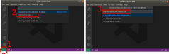

# Working on a HPC Cluster

:::highlight
#### Questions

- How do I access a HPC?
- How do I edit files on the HPC?
- How do I move files in/out of the HPC?

#### Learning Objectives

- Understand the use of different software tools to interface with a HPC server: terminal, text editor and file transfer software.
- Login to the HPC using _SSH_ and navigate its filesystem.
- Edit scripts on the HPC using _Nano_ or _VS Code_.
- Move files in and out of the HPC storage using _Filezilla_ or `rsync`/`scp`. 
:::


## Connecting to the HPC {.tabset}

All interactions with the HPC happen via the terminal (or command line). 
To connect to the HPC we use the program `ssh`. 
The syntax is: 

```console
ssh your-hpc-username@hpc-address
```

After running this command you will be asked for your password and after typing it you will be logged in to the HPC. 

### Mac / Linux

On Mac and Linux you can open your inbuilt terminal:

- Mac: press <kbd><kbd>&#8984;</kbd> + <kbd>space</kbd></kbd> to open _spotlight search_, search for "terminal" and press enter.
- Linux: press the <kbd><kbd>Ctrl</kbd> + <kbd>Alt</kbd> + <kbd>T</kbd></kbd> shortcut.


:::note
**Copy/Paste on Mac/Linux terminals**

To copy and paste text on Mac OS you can use the usual keyboard shortcuts <kbd><kbd>&#8984;</kbd> + <kbd>C</kbd></kbd> and <kbd><kbd>&#8984;</kbd> + <kbd>V</kbd></kbd>.

On Linux you have to use the shortcut <kbd><kbd>Ctrl</kbd> + <kbd>Shift</kbd> + <kbd>C</kbd></kbd> and <kbd><kbd>Ctrl</kbd> + <kbd>Shift</kbd> + <kbd>V</kbd></kbd>.

Alternatively, you can use the right mouse button on both operating systems. 
:::

### Windows

On Windows we are using the _MobaXterm_ program, which emulates a unix-like terminal on Windows. 
Other alternatives include the [Windows Subsystem for Linux (WSL)](https://docs.microsoft.com/en-us/windows/wsl/) (recommended if you want a full Linux experience from within Windows) or the program [Putty](https://www.chiark.greenend.org.uk/~sgtatham/putty/latest.html). 


:::note
**Copy/Paste on MobaXterm**

To paste text to the MobaXterm terminal you can use the right-click mouse button. 
The first time you right-click with your mouse on the terminal, a window will open asking what you would like to do. 
Select "Paste" (the default) and, from there on, every time you right-click on the terminal it will paste text from your clipboard. 
:::


## {.unlisted .unnumbered}

:::exercise

After registering for a HPC account, you were sent the following information by the computing support:

> An account has been created for you on our HPC. 
> 
> - Username: emailed separately
> - Password: emailed separately
> - Host: `train.bio`
> 
> You were automatically allocated 40GB in `/home/USERNAME/` and 1TB in `/scratch/USERNAME/`. 

1. Connect to the training HPC using `ssh`. (Note: when you type your password, nothing shows on the screen - that's normal, the password is still being input.)
2. Take some time to explore your home directory to identify what files and folders are in there. 
Can you identify and navigate to your scratch directory?
3. Use the commands `free -h` (available RAM memory) and `nproc --all` (number of CPU cores available) to check the capabilities of the login node of our HPC. Check how many people are logged in to the HPC login node using the command `who`.

<details><summary>Answer</summary>

**A1.**

To login to the HPC we run the following from the terminal:

```bash
ssh USERNAME@train.bio
```

Replacing "USERNAME" by your HPC username. 
After typing it, you will be prompted for your password. 
Note that as you type the password nothing shows on the screen - that's normal! 
The password is still being input. 

**A2.**

We can get a detailed list of the files on our home directory:

```console
ls -l
```

This will reveal that there is a shell script (`.sh` extension) named `slurm_submit_template.sh` and also a shortcut to our scratch directory. 
We can see that this is a shortcut because of the way the output is printed as `scratch -> /scratch/username/`. 

Therefore, to navigate to our scratch directory we can either use the shortcut from our home or use the full path:

```console
cd ~/scratch       # using the shortcut from the home directory
cd /scratch/USERNAME/  # using the full path
```

Remember that `~` indicates your home directory, which in Linux filesystems is `/home/USERNAME/`.

**A3.**

The main thing to consider in this question is where you run the commands from. 
To get the number of CPUs and memory on your computer make sure you open a new terminal and that you see something like `[your-local-username@laptop: ~]$` (where "user" is the username on your personal computer and "laptop" is the name of your personal laptop).
Note that this does not work on the MacOS shell (see [this post](https://www.macworld.co.uk/how-to/how-check-mac-specs-processor-ram-3594298/) for instructions to find the specs of your Mac). 

Conversely, to obtain the same information for the HPC, make sure you are logged in to the HPC when you run the commands. 
You should see something like `[your-hpc-username@login ~]$`.

To see how many people are currently on the login node we can combine the `who` and `wc` commands:

```bash
# pipe the output of `who` to `wc`
# the `-l` flag instructs `wc` to count "lines" of its input
who | wc -l
```

You should notice that several people are using the same login node as you.
This is why we should **never run resource-intensive applications on the login node** of a HPC. 

</details>
:::

:::note
**Passwordless Login**

To make your life easier, you can configure `ssh` to login to a server without having to type your password or username.
This can be done using SSH key based authentication. 
See [this page](https://code.visualstudio.com/docs/remote/troubleshooting#_quick-start-using-ssh-keys) with detailed instructions of how to create a key and add it to the remote host. 
:::


## Editing Scripts Remotely

Most of the work you will be doing on a HPC is editing script files.
These may be scripts that you are developing to do a particular analysis or simulation, for example (in _Python_, _R_, _Julia_, etc.).
But also - and more relevant for this course - you will be writing **shell scripts** containing the commands that you want to be executed on the compute nodes.

There are several possibilities to edit text files on a remote server.
A simple one is to use the program _Nano_ directly from the terminal. 
This is a simple text editor available on most linux distributions, and what we will use in this course.

Although _Nano_ is readily available and easy to use, it offers limited functionality and is not as user friendly as a full-featured text editor.
Therefore, we also include a bonus section below introducing _Visual Studio Code_ (_VS Code_ for short), which is an open-source software with a wide range of functionality and several extensions, including one for working on remote servers.


### Nano


To create a file with _Nano_ you can run the command:

```console
nano test.sh
```

This opens a text editor, where you can type the code that you want to save in the file. 
Once we're happy with our code, we can press <kbd>Ctrl</kbd>+<kbd>O</kbd> to write our data to disk. 
We'll be asked what file we want to save this to: press <kbd>Enter</kbd> to confirm the filename.
Once our file is saved, we can use <kbd>Ctrl</kbd>+<kbd>X</kbd> to quit the editor and return to the shell.

We can check with `ls` that our new file is there. 

) and is a way to inform that this script uses the program `bash` to run the script.](images/nano.png)

Note that because we saved our file with `.sh` extension (the conventional extension used for shell scripts), _Nano_ does some colouring of our commands (this is called _syntax highlighting_) to make it easier to read the code. 


:::exercise

Make sure you are in the workshop folder (`cd ~/scratch/hpc_workshop`).

1. Create a new script file called `check_hostname.sh`. Copy the code shown below into this script and save it.
1. From the terminal, run the script using `bash`.

```bash
#!/bin/bash
echo "This job is running on:"
hostname
```

<details><summary>Answer</summary>
**A1.**

To create a new script in _Nano_ we use the command:

```console
nano check_hostname.sh
```

This opens the editor, where we can copy/paste our code. 
When we are finished we can click <kbd>Ctrl</kbd>+<kbd>X</kbd> to exit the program, and it will ask if we would like to save the file. 
We can type "Y" (Yes) followed by <kbd>Enter</kbd> to confirm the file name. 

**A2.**

We can run the script from the terminal using:

```console
bash test.sh
```

Which should print the result (your hostname might vary slightly from this answer):

```
This job is running on:
train.bio
```

</details>
:::


### (Bonus) Visual Studio Code


_VS Code_ is a fully-featured programming text editor available for all major platforms (Mac, Linux, Windows). 
One of the strenghts of this text editor is the wide range of extensions it offers.
One of those extensions is called _Remote SHH_ and allows us to connect to a remote computer (via _ssh_) and edit files as if they were on our own computer. 
See the [Setup](99-setup.html) page for how to install both _VS Code_ and this extension.

To connect VS Code to the HPC (see Figure 3):

1. Click the "Open Remote Window" green button on the bottom left corner.
2. Click "Connect to Host..." in the popup menu that opens.
3. Click "+ Add New SSH Host...".
4. Type your username and HPC hostname in the same way you do with `ssh`.
5. Select SSH configuration file to save this information for the future. Select the first file listed in the popup menu (a file in your user's home under `.ssh/config`).
6. A menu pops open on the bottom right informing the host was added to the configuration file. Click "Connect".
7. You may be asked what kind of platform you are connecting to. HPC environments always run on Linux. 
8. The first time you connect to a host you will also be asked if you trust this computer. You can answer "Continue". 
9. Finally, you will be asked for your password. Once you are connected the green button on the bottom-left corner should change to indicate you are ssh'd into the HPC
10. To open a folder on the HPC, use the left-hand "Explorer" and click "Open Folder"
11. Type the _path_ to the folder on the HPC from where you want to work from and press OK
    * You may be asked for your password again. The first time you connect to a folder you will also be asked "Do you trust the authors of the files in this folder?", to which you can answer "Yes, I trust the authors".

<div class="figure">
  <a href="images/vscode_ssh.svg" target="_blank">
    
  </a>
  <p class="caption">
    Steps to connect to a remote server with _VS Code_. Click the image to open a larger size.
  </p>
</div>

Once you are connected to the HPC in this way, you can edit files and even create new files and folders on the HPC filesystem.
You can also **open a terminal within VS Code** by going to the menu "Terminal > New Terminal".

:::exercise

If you haven't already done so, connect your VS Code to the HPC following the instructions below.

<details><summary>Connecting VS Code to remote host</summary></details>

1. Open the `hpc_workshop` folder on VS Code (this is the folder you created in the previous exercise).
1. Create a new file (File > New File) and save it as `check_hostname.sh`. Copy the code shown below into this script and save it.
1. From the terminal, run this script with `bash check_hostname.sh`

```bash
#!/bin/bash
echo "This job is running on:"
hostname
```

<details><summary>Answer</summary>
**A1.**

To open the folder we follow the instructions in Figure 3 and use the following path:
`/scratch/user/hpc_workshop`
(replacing "user" with your username)

**A2.**

To create a new script in VS Code we can go to "File > New File" or use the <kbd>Ctrl + N</kbd> shortcut.
To save the file we can use the <kbd>Ctrl + S</kbd> shortcut. 

**A3.**

We can run the script from the terminal.
First make sure you are on the correct folder:

```console
cd /scratch/user/hpc_workshop
```

Then run the script:

```console
bash test.sh
```

</details>
:::


## Moving Files

There are several options to move data between your local computer and a remote server.
We will cover three possibilities in this section, which vary in their ease of use.

A quick summary of these tools is given in the table below. 

| | Filezilla | SCP | Rsync |
| :-: | :-: | :-: | :-: |
| Interface | GUI | Command Line | Command Line |
| Data synchronisation | yes | no | yes |


### Filezilla (GUI)

This program has a graphical interface, for those that prefer it and its use is relatively intuitive.

To connect to the remote server (see Figure 3): 

1. Fill in the following information on the top panel:
  - Host: train.bio
  - Username: your HPC username
  - Password: your HPC password
  - Port: 22
1. Click "Quickconnect" and the files on your "home" should appear in a panel on right side.
1. Navigate to your desired location by either clicking on the folder browser or typing the directory path in the box "Remote site:".
1. You can then drag-and-drop files between the left side panel (your local filesystem) and the right side panel (the HPC filesystem), or vice-versa.


### `scp` (command line)

This is a command line tool that can be used to copy files between two servers.
One thing to note is that it always transfers all the files in a folder, regardless of whether they have changed or not.

The syntax is as follows:

```bash
# copy files from the local computer to the HPC
scp -r path/to/source_folder <user>@train.bio:path/to/target_folder

# copy files from the HPC to a local directory
scp -r <user>@train.bio:path/to/source_folder path/to/target_folder
```

The option `-r` ensures that all sub-directories are copied (instead of just files, which is the default).


### `rsync` (command line)

This program is more advanced than `scp` and has options to synchronise files between two directories in multiple ways. 
The cost of its flexibility is that it can be a little harder to use. 

The most common usage is:

```bash
# copy files from the local computer to the HPC
rsync -auvh --progress path/to/source_folder <user>@train.bio:path/to/target_folder

# copy files from the HPC to a local directory
rsync -auvh --progress <user>@train.bio:path/to/source_folder path/to/target_folder
```

- the options `-au` ensure that only files that have changed _and_ are newer on the source folder are transferred
- the options `-vh` give detailed information about the transfer and human-readable file sizes
- the option `--progress` shows the progress of each file being transferred

:::warning

When you specify the *source* directory as `path/to/source_folder/` (with `/` at the end) or `path/to/source_folder` (without `/` at the end), `rsync` will do different things:

- `path/to/source_folder/` will copy the files *within* `source_folder` but not the folder itself
- `path/to/source_folder` will copy the actual `source_folder` as well as all the files within it
:::

:::note
**TIP** 

To check what files `rsync` would transfer but not actually transfer them, add the `--dry-run` option. This is useful to check that you've specified the right source and target directories and options.
:::


:::exercise

**Note:** only do this exercise if you are following the materials by yourself as a self-learner. For those attending our live workshop we already put the materials on the training HPC.

- <a href="https://www.dropbox.com/sh/mcu1hjxlr8yqxxa/AAB8s5NcHZH1Tkof4B5JXuyLa?dl=0" target="_blank" rel="noopener noreferrer">Download the data</a> for this course to your computer and place it on your Desktop. (do not unzip the file yet!)
- Use _Filezilla_, `scp` or `rsync` (your choice) to move this file to the directory we created earlier: `/scratch/user/hpc_workshop/`. 
- The file we just downloaded is a compressed file. From the HPC terminal, use `unzip` to decompress the file.
- Bonus: how many shell scripts (files with `.sh` extension) are there in your project folder? 

<details><summary>Answer</summary>

Once we download the data to our computer, we can transfer it using either of the suggested programs. 
We show the solution using command-line tools.

Notice that these commands are **run from your local terminal**:

```bash
# with scp
scp -r ~/Desktop/hpc_workshop_files.zip username@train.bio:scratch/hpc_workshop/

# with rsync
rsync -avhu ~/Desktop/hpc_workshop_files.zip username@train.bio:scratch/hpc_workshop/
```

Once we finish transfering the files we can go ahead and decompress the data folder. 
Note, this is now run **from the HPC terminal**:

```bash
# make sure to be in the correct directory
cd ~/scratch/hpc_workshop/

# decompress the files
unzip hpc_workshop_files.zip
```

Finally, we can check how many shell scripts there are using the `find` program and piping it to the `wc` (word/line count) program:

`find -type f -name "*.sh" | wc -l`

`find` is a very useful tool to find files, check this [Find cheatsheet](https://devhints.io/find) to learn more about it.

</details>
:::


## Summary

:::highlight
#### Key Points

- The terminal is used to connect and interact with the HPC. 
  - To connect to the HPC we use `ssh username@remote-hostname`.
- To transfer files to/from the HPC we can use _Filezilla_, which offers a user-friendly interface to synchronise files between your local computer and a remote server.
  - Transfering files can also be done from the command line, using tools such as `scp` and `rsync` (this is the most flexible tool but also more advanced). 
- _Nano_ is a text editor that is readily available on HPC systems. 
  - To create or edit an existing file we use the command `nano path/to/filename.sh`. 
  - Keyboard shortcuts are used to save the file (<kbd>Ctrl + O</kbd>) and to exit (<kbd>Ctrl + X</kbd>).
- _Visual Studio Code_ is a text editor that can be used to edit files directly on the HPC using the "Remote-SSH" extension. 

:::

