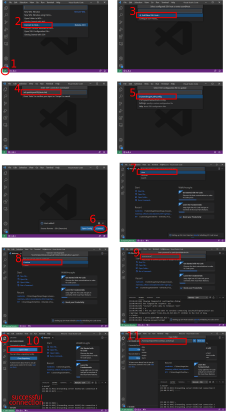

:::{.callout-tip}
#### Learning Objectives

- Connect to a HPC server using _SSH_ and navigate its filesystem.
- Edit scripts directly from the HPC using a terminal-based text editor such as `nano`.
- Connect the _VS Code_ text editor to a remote server and use it to edit and run scripts.
:::

![Useful tools for working on a remote HPC server. The terminal is used to login to the HPC server and interact with it (e.g. submit jobs, navigate the filesystem). _Visual Studio Code_ is a text editor that has the ability to connect to a remote server so that we can edit scripts stored on the HPC. _Nano_ is a simpler text editor available directly from the terminal (no need to install anything). _Filezilla_ is an FTP application, which can be used to transfer files between the HPC and your local computer.](images/tool_overview.svg)

## Connecting to the HPC

All interactions with the HPC happen via the terminal. 
To connect to the HPC we use the program `ssh`. 
The syntax is: 

```bash
ssh your-hpc-username@hpc-address
```

After running this command you will be asked for your password and after typing it you will be logged in to the HPC. 

Note that **the first time you login** to a server, you will be presented with a message similar to: 

```
The authenticity of host '[192.168.1.59]:2231 ([192.168.1.59]:2231)' can't be established.
RSA key fingerprint is SHA256:4X1kUMDOG021U52XDL2U56GFIyC+S5koImofnTHvALk.
Are you sure you want to continue connecting (yes/no)?
```

If you are confident about the security of the server you are connecting to, you can type `yes`. 
Often, the server fingerprint is sent by the HPC admins ahead of time (or available in the documentation) for you to compare and confirm you are connecting to the correct server. 
For example, at Cambridge, we are provided with this information on the [CSD3 documentation page](https://docs.hpc.cam.ac.uk/hpc/user-guide/hostkeys.html?highlight=fingerprint). 


::: {.panel-tabset group="os"}
### Windows

:::{.panel-tabset}

#### MobaXterm

On Windows, if you are using the _MobaXterm_ program, you can open a terminal as shown below. 
To **paste** text to the MobaXterm terminal you can use the right-click mouse button. 
The first time you right-click with your mouse on the terminal, a window will open asking what you would like to do. 
Select "Paste" (the default) and, from there on, every time you right-click on the terminal it will paste text from your clipboard. 

![Login to HPC using the _MobaXterm_ terminal. **1)** Click "Start local terminal" **2)** Use the ssh program to connect to the HPC. You may get a warning if this is the first time you connect; if you trust the server, type "yes". **3)** You will then be asked for your password. Note that as you type the password nothing shows on the screen, but that's normal. A window might open asking you whether you would like to save the password - answer "No". **4)** You will receive a login message your terminal will now indicate your HPC username and the name of the HPC server.](images/terminal_mobaxterm.svg)


#### WSL

To open the terminal search for "Terminal" on your Windows apps. 

To **copy and paste** text you can use the usual keyboard shortcuts <kbd>Ctrl</kbd> + <kbd>C</kbd> and <kbd>Ctrl</kbd> + <kbd>V</kbd>.
Alternatively, you can use the right mouse button. 


#### Putty

An alternative way to connect to a remote server on Windows is to use the program [_Putty_](https://www.chiark.greenend.org.uk/~sgtatham/putty/latest.html). 
This is less flexible than the other two alternatives, as it doesn't give you command-line tools for file transfer (covered in a [later chapter](07-files.md)).


:::


### macOS

To open the terminal press <kbd><kbd>&#8984;</kbd> + <kbd>space</kbd></kbd> to open _spotlight search_. 
Search for "terminal" and press enter.

To **copy and paste** text you can use the usual keyboard shortcuts <kbd><kbd>&#8984;</kbd> + <kbd>C</kbd></kbd> and <kbd><kbd>&#8984;</kbd> + <kbd>V</kbd></kbd>.
Alternatively, you can use the right mouse button. 


### Linux

You can open your terminal using the keyboard shortcut: <kbd><kbd>Ctrl</kbd> + <kbd>Alt</kbd> + <kbd>T</kbd></kbd>.
To **copy and paste** text on the terminal you have to use the shortcut <kbd><kbd>Ctrl</kbd> + <kbd>Shift</kbd> + <kbd>C</kbd></kbd> and <kbd><kbd>Ctrl</kbd> + <kbd>Shift</kbd> + <kbd>V</kbd></kbd>.
Alternatively, you can use the right mouse button. 


:::


### Exercise: SSH

:::{.callout-exercise}

After registering for a HPC account, you were sent the following information by the computing support:

> An account has been created for you on our HPC. 
> 
> - Username: emailed separately
> - Password: emailed separately
> - Host: `train.bio`
> 
> You were automatically allocated 40GB in `/home/USERNAME/` and 1TB in `/scratch/USERNAME/`. 

1. Connect to the training HPC using `ssh`. (Note: when you type your password, nothing shows on the screen - that's normal, the password is still being input.)
2. Take some time to explore your home directory to identify what files and folders are in there. 
Can you identify and navigate to your scratch directory?
3. Use the commands `free -h` (available RAM memory) and `nproc --all` (number of CPU cores available) to check the capabilities of the login node of our HPC. Check how many people are logged in to the HPC login node using the command `who`.

:::{.callout-answer}

**A1.**

To login to the HPC we run the following from the terminal:

```bash
ssh USERNAME@train.bio
```

Replacing "USERNAME" by your HPC username. 
After typing it, you will be prompted for your password. 
Note that as you type the password nothing shows on the screen - that's normal! 
The password is still being input. 

**A2.**

We can get a detailed list of the files on our home directory:

```bash
ls -l
```

This will reveal that there is a shell script (`.sh` extension) named `slurm_submit_template.sh` and also a shortcut to our scratch directory. 
We can see that this is a shortcut because of the way the output is printed as `scratch -> /scratch/username/`. 

Therefore, to navigate to our scratch directory we can either use the shortcut from our home or use the full path:

```bash
cd ~/scratch       # using the shortcut from the home directory
cd /scratch/USERNAME/  # using the full path
```

Remember that `~` indicates your home directory, which in Linux filesystems is `/home/USERNAME/`.

**A3.**

The main thing to consider in this question is where you run the commands from. 
To get the number of CPUs and memory on your computer make sure you open a new terminal and that you see something like `[your-local-username@laptop: ~]$` (where "user" is the username on your personal computer and "laptop" is the name of your personal laptop).
Note that this does not work on the MacOS shell (see [this post](https://www.macworld.co.uk/how-to/how-check-mac-specs-processor-ram-3594298/) for instructions to find the specs of your Mac). 

Conversely, to obtain the same information for the HPC, make sure you are logged in to the HPC when you run the commands. 
You should see something like `[your-hpc-username@login ~]$`.

To see how many people are currently on the login node we can combine the `who` and `wc` commands:

```bash
# pipe the output of `who` to `wc`
# the `-l` flag instructs `wc` to count "lines" of its input
who | wc -l
```

You should notice that several people are using the same login node as you.
This is why we should **never run resource-intensive applications on the login node** of a HPC. 

:::
:::

:::{.callout-note}
#### Passwordless Login

To make your life easier, you can configure `ssh` to login to a server without having to type your password or username.
This can be done using SSH key based authentication. 
See [this page](https://code.visualstudio.com/docs/remote/troubleshooting#_quick-start-using-ssh-keys) with detailed instructions of how to create a key and add it to the remote host. 
:::


## Editing Scripts Remotely

Most of the work you will be doing on a HPC is editing script files.
These may be scripts that you are developing to do a particular analysis or simulation, for example (in _Python_, _R_, _Julia_, etc.).
But also - and more relevant for this course - you will be writing **shell scripts** containing the commands that you want to be executed on the compute nodes.

There are several possibilities to edit text files on a remote server.
A simple one is to use the program _Nano_ directly from the terminal. 
This is a simple text editor available on most linux distributions, and what we will use in this course.

Although _Nano_ is readily available and easy to use, it offers limited functionality and is not as user friendly as a full-featured text editor.
Therefore, we also include a bonus section below introducing _Visual Studio Code_ (_VS Code_ for short), which is an open-source software with a wide range of functionality and several extensions, including one for working on remote servers.


### Nano


To create a file with _Nano_ you can run the command:

```bash
nano test.sh
```

This opens a text editor, where you can type the code that you want to save in the file. 
Once we're happy with our code, we can press <kbd>Ctrl</kbd>+<kbd>O</kbd> to write our data to disk. 
We'll be asked what file we want to save this to: press <kbd>Enter</kbd> to confirm the filename.
Once our file is saved, we can use <kbd>Ctrl</kbd>+<kbd>X</kbd> to quit the editor and return to the shell.

We can check with `ls` that our new file is there. 

) and is a way to inform that this script uses the program `bash` to run the script.](images/nano.png)

Note that because we saved our file with `.sh` extension (the conventional extension used for shell scripts), _Nano_ does some colouring of our commands (this is called _syntax highlighting_) to make it easier to read the code. 


### Exercise: Nano

:::{.callout-exercise}

Make sure you are in the workshop folder (`cd ~/scratch/hpc_workshop`).

1. Create a new script file called `check_hostname.sh`. Copy the code shown below into this script and save it.
1. From the terminal, run the script using `bash`.

```bash
#!/bin/bash
echo "This job is running on:"
hostname
```

:::{.callout-answer}
**A1.**

To create a new script in _Nano_ we use the command:

```bash
nano check_hostname.sh
```

This opens the editor, where we can copy/paste our code. 
When we are finished we can click <kbd>Ctrl</kbd>+<kbd>X</kbd> to exit the program, and it will ask if we would like to save the file. 
We can type "Y" (Yes) followed by <kbd>Enter</kbd> to confirm the file name. 

**A2.**

We can run the script from the terminal using:

```bash
bash test.sh
```

Which should print the result (your hostname might vary slightly from this answer):

```
This job is running on:
train.bio
```

:::
:::


### Visual Studio Code {#sec-vscode}


_VS Code_ is a fully-featured programming text editor available for all major platforms (Mac, Linux, Windows). 
One of the strenghts of this text editor is the wide range of extensions it offers.
One of those extensions is called **Remote SHH** and allows us to connect to a remote computer (via _ssh_) and edit files as if they were on our own computer. 
See [Data & Setup](../setup.md) for how to install both _VS Code_ and this extension.

To connect VS Code to the HPC (see image below):

1. Click the "Open Remote Window" green button on the bottom left corner.
2. Click "Connect to Host..." in the popup menu that opens.
3. Click "+ Add New SSH Host...".
4. Type your username and HPC hostname in the same way you do with `ssh`.
5. Select SSH configuration file to save this information for the future. Select the first file listed in the popup menu (a file in your user's home under `.ssh/config`).
6. A menu pops open on the bottom right informing the host was added to the configuration file. Click "Connect".
7. You may be asked what kind of platform you are connecting to. HPC environments always run on Linux. 
8. The first time you connect to a host you will also be asked if you trust this computer. You can answer "Continue". 
9. Finally, you will be asked for your password. Once you are connected the green button on the bottom-left corner should change to indicate you are ssh'd into the HPC
10. To open a folder on the HPC, use the left-hand "Explorer" and click "Open Folder"
11. Type the _path_ to the folder on the HPC from where you want to work from and press OK
    * You may be asked for your password again. The first time you connect to a folder you will also be asked "Do you trust the authors of the files in this folder?", to which you can answer "Yes, I trust the authors".

<!-- inserting image with HTML to have a clickable link -->
<div class="quarto-figure quarto-figure-center">
  <figure class="figure">
    <p>
      <a href="images/vscode_ssh.svg" target="_blank">
        
      </a>
    </p>
    <figcaption class="figure-caption">
      Steps to connect to a remote server with _VS Code_. Click the image to open a larger size.
    </figcaption>
  </figure>
</div>

Once you are connected to the HPC in this way, you can edit files and even create new files and folders on the HPC filesystem.
You can also **open a terminal within VS Code** by going to the menu "Terminal > New Terminal".

:::{.callout-note}
#### Two-factor authentication

If your HPC requires two-factor authentication, then you need to make sure to have the correct setting in the `Remote-SSH` extension: 

- Go to <kbd>File</kbd> → <kbd>Preferences</kbd> → <kbd>Settings</kbd>
- In the search box type "Remote SSH: Show Login Terminal"
- Make sure the option "Always reveal the SSH login terminal" is _ticked_.

With this option turned on, when you try to connect to the HPC, a terminal will open that will ask for your password and two-factor authentication code. 
:::


### Exercise: VS Code

:::{.callout-exercise}

If you haven't already done so, connect your VS Code to the HPC following the instructions detailed in @sec-vscode.

1. Open the `hpc_workshop` folder on VS Code.
2. Create a new file (File > New File) and save it as `check_hostname.sh`. Copy the code shown below into this script and save it.

    ```bash
    #!/bin/bash
    echo "This job is running on:"
    hostname
    ```

3. Open a terminal within VS Code ("Terminal > New Terminal") and run this script with `bash check_hostname.sh`


:::{.callout-answer}
**A1.**

To open the folder we follow the instructions in @sec-vscode (steps 10 and 11) and use the following path:
`/scratch/user/hpc_workshop`
(replacing "user" with your username)

**A2.**

To create a new script in VS Code we can go to "File > New File" or use the <kbd>Ctrl + N</kbd> shortcut.
To save the file we can use the <kbd>Ctrl + S</kbd> shortcut. 

**A3.**

After opening the terminal, we can run the script using _Bash_: 

```bash
bash check_hostname.sh
```

:::
:::


## Summary

:::{.callout-tip}
#### Key Points

- The terminal is used to connect and interact with the HPC. 
  - To connect to the HPC we use `ssh username@remote-hostname`.
- _Nano_ is a text editor that is readily available on HPC systems. 
  - To create or edit an existing file we use the command `nano path/to/filename.sh`. 
  - Keyboard shortcuts are used to save the file (<kbd>Ctrl + O</kbd>) and to exit (<kbd>Ctrl + X</kbd>).
- _Visual Studio Code_ is a text editor that can be used to edit files directly on the HPC using the "Remote-SSH" extension. 

:::

