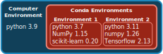

# Software Management

:::{.callout-tip}
#### Learning Objectives

- Use the `module` tool to search for and load pre-installed software.
- Describe what a package manager is, and how it can be used to manage software instalation on a HPC environment.
- Install the _Mamba_ package manager.
- Create a software environment and install software using _Mamba_.
- Describe what a software container is and how it differs from a package manager.
- Download and use a pre-existing software container for bioinformatics and scientific computing applications. 
:::


## Using pre-installed software {#sec-module}

It is very often the case that HPC admins have pre-installed several software packages that are regularly used by their users. 
Because there can be a large number of packages (and often different versions of the same program), you need to load the programs you want to use in your script using the `module` tool. 

The following table summarises the most common commands for this tool:

| Command | Description |
| -: | :- |
| `module avail ` | List all available packages. |
| `module avail -a -i "pattern"` <br> or <br> `module avail 2>&1 | grep -i "pattern"` | Search the available package list that matches "pattern". Note the second option is given as some versions of `module` do not support case-insensitive search (`-i` option). |
| `module load <program>` | Load the program and make it available for use. |
| `module unload <program>` | Unload the program (removes it from your PATH). |

For example, on our training HPC, you can try to run `module avail` to see which software is available. 
We can see a software called `bowtie2`. 
If we try to use this software at the moment we get an error: 

```bash
bowtie2 --version
```

```
Command 'bowtie2' not found, but can be installed with:

apt install bowtie2
Please ask your administrator.
```

But if we load the software first, then the command works: 

```bash
module load bowtie/2.5.0
bowtie2 --version
```

```
/usr/local/Cluster-Apps/bowtie/2.5.0/bowtie2-align-s version 2.5.0
64-bit
Built on login-e-12
Mon 14 Nov 12:11:12 UTC 2022
Compiler: gcc version 4.8.5 20150623 (Red Hat 4.8.5-44) (GCC)
Options: -O3 -msse2 -funroll-loops -g3 -std=c++11 -DPOPCNT_CAPABILITY -DNO_SPINLOCK -DWITH_QUEUELOCK=1
Sizeof {int, long, long long, void*, size_t, off_t}: {4, 8, 8, 8, 8, 8}
```

If you `echo $PATH`, you will notice the installer has been added to your PATH variable (the environment variable that tells the shell where to find programs to run). 
Once you run `module unload bowtie2/2.5.0`, and then `echo $PATH` again, you notice the PATH variable will have been modified. 
This is how the _Environment Modules_ package makes software available for you to use. 

If a package is not available through the `module` command, your only option is to contact the HPC admin and ask them to install it for you. 
Alternatively, you can use a package manager as we show in the next section.


## The _Mamba_ package manager

Often you may want to use software packages that are not installed by default on the HPC.
There are several ways you could manage your own software installation, but in this course we will be using the **package manager _Mamba_**, which is a successor to another package manager called _Conda_.

_Conda_ and _Mamba_ are package managers commonly used in data science, scientific computing, and bioinformatics. 
_Conda_, originally developed by [Anaconda](https://anaconda.org/), is a package manager and environment manager that simplifies the creation, distribution, and management of software environments containing different packages and dependencies. 
It is known for its cross-platform compatibility and ease of use. 
**_Mamba_** is a more recent and high-performance alternative to _Conda_. 
While it maintains compatibility with Conda's package and environment management capabilities, _Mamba_ is designed for faster dependency resolution and installation, making it a better choice nowadays. 

One of the strengths of using _Mamba_ to manage your software is that you can have different versions of your software installed alongside each other, organised in **environments**. 
Organising software packages into environments is extremely useful, as it allows to have a _reproducible_ set of software versions that you can use and resuse in your projects. 

For example, imagine you are a data scientist working on a project that involves machine learning. 
You have two projects with different requirements (@fig-conda):

- Project A: This project requires Python 3.7, NumPy 1.15, and scikit-learn 0.20, among other libraries.
- Project B: This project needs Python 3.9, the latest version of NumPy, and TensorFlow 2.0.

If you don't use environments, you would need to install and maintain these packages globally on your system. 
This can lead to several issues:

- Version conflicts: different projects may require different versions of the same library. For example, Project A might not be compatible with the latest NumPy, while Project B needs it.
- Dependency chaos: as your projects grow, you might install numerous packages, and they could interfere with each other, causing unexpected errors or instability.
- Difficulty collaborating: sharing your code with colleagues or collaborators becomes complex because they may have different versions of packages installed, leading to compatibility issues.

{#fig-conda}

**Environments allow you to create isolated, self-contained environments for each project**, addressing these issues:

- Isolation: you can create a separate environment for each project using tools like _Conda_/_Mamba_ or virtualenv in Python. This ensures that the dependencies for one project don't affect another.
- Version control: you can specify the exact versions of libraries and packages required for each project within its environment. This eliminates version conflicts and ensures reproducibility.
- Ease of collaboration: sharing your code and environment file (e.g., requirements.txt for Python) makes it easy for collaborators to replicate your environment and run your project without worrying about conflicts.
- Simplified maintenance: If you need to update a library for one project, it won't impact others. You can manage environments separately, making maintenance more straightforward.

In the context of HPC clusters, another advantage of using _Mamba_ is that the **software is installed locally** (by default in your home directory), without the need for admin permissions. 


:::{.callout-note}
#### Mamba versus Module

Although _Mamba_ is a great tool to manage your own software installation, the disadvantage is that the software is not compiled specifically taking into account the hardware of the HPC. 
This is a slightly technical topic, but the main practical consequence is that software installed by HPC admins and made available through the `module` system may sometimes run faster than software installed via `mamba`. 
This means you will use fewer resources and your jobs will complete faster.
:::


### Installing _Mamba_

Before you use _Mamba_, you will need to install it on the HPC. 
If you are attending our live course, we already have _Mamba_ installed, so you can skip this step. 

To install _Mamba_, run the following commands from the terminal (this will install it in its default location in the home directory): 

```bash
wget "https://github.com/conda-forge/miniforge/releases/latest/download/Miniforge3-$(uname)-$(uname -m).sh"
bash Miniforge3-$(uname)-$(uname -m).sh -b -p $HOME/miniforge3
rm Miniforge3-$(uname)-$(uname -m).sh
$HOME/miniforge3/bin/mamba shell init --shell bash
```

Logout of the HPC and login again, to restart your terminal. 
Your shell should now start with the word `(base)`.

Then run the following commands: 

```bash
conda config --add channels bioconda; conda config --add channels conda-forge
conda config --set remote_read_timeout_secs 1000
```

The software installation "recipes" used by _Mamba_ are maintained by large communities of software developers. 
These communities are organised by **channels**, i.e. software repositories. 
Two popular channels are "[bioconda](https://bioconda.github.io/conda-package_index.html)", which maintains bioinformatics software and "[conda-forge](https://conda-forge.org/feedstock-outputs/)", which maintains several data science packages. 
Some of the commands we just ran add these channels to our _Mamba_ installation, so that it looks for software in those repositories by default.


### Installing software with `mamba`

The command used to install and manage software is called `mamba`. 
Although we will only cover the basics in this course, it has an [excellent documentation](https://docs.conda.io/projects/conda/en/latest/user-guide/) and a useful [cheatsheet](https://docs.conda.io/projects/conda/en/4.6.0/_downloads/52a95608c49671267e40c689e0bc00ca/conda-cheatsheet.pdf).

:::{.callout-note}
#### `conda` or `mamba`?

Some of the documentation we point to is for `conda`, but as we said earlier `mamba` is its newer implementation, so these two commands can be used interchangeably (mostly). 
The easy rule-of-thumb is: whenever you see the command `conda` you can use `mamba` instead.
:::

The first thing to do is to **create a software environment** for our project. 
Although this is optional (you could instead install everything in the "base" default environment), it is a good practice as it means the software versions remain stable within each project. 

To create an environment we use:

```bash
mamba create --name ENV
```

Where "ENV" is the name we want to give to that environment. 
Once the environment is created, we can install packages using:

```bash
mamba install --name ENV PROGRAM
```

Where "PROGRAM" is the name of the software we want to install. 

:::{.callout-note}
#### Organising environments 

One way to organise your software environments is to create an environment for each kind of analysis that you might be doing regularly. 
For example, you could have an environment named `imaging` with software that you use for image processing (e.g. Python's scikit-image or the ImageMagick package) and another called `deeplearn` with software you use for deep learning applications (e.g. Python's Keras).

In some situations (in particular in bioinformatics), software packages can have a very large number of software dependencies leading to incompatibilities across packages. 
In those situations, it may be best to have a separate environment for each software.
:::

To search for the software packages that are available through `mamba`:

- go to [anaconda.org](https://anaconda.org).
- in the search box search for a program of your choice. For example: "bowtie2".
- the results should be listed as `CHANNEL/PROGRAM`, where *CHANNEL* will the the source repository from where the software is available. Usually scientific/bioinformatics software is available through the `conda-forge` and `bioconda` channels.

You can specify the channel explicitly during the install command using the `-c` option. 
For example `mamba install --channel CHANNEL --name ENV PROGRAM`.

Let's see this with an example, where we create a new environment called "datasci" and install some python packages for data science work:

```bash
mamba create --name datasci
mamba install --name datasci --channel conda-forge numpy=1.26.4 matplotlib=3.8.3
```

Note that, in this case, we were explicit in specifying the version of each software we want. 
This is recommended for reproducibility of analysis and can make environments more stable to manage. 
If you don't specify the version you want, then Mamba will install the latest version that is compatible with your environment. 

To see all the environments you have available, you can use:

```bash
mamba env list
```

```
# conda environments:
#
base                  *  /home/participant36/mambaforge
datasci                  /home/participant36/mambaforge/envs/datasci
```

In our case it lists the _base_ (default) environment and the newly created _datasci_ environment.
The asterisk ("*") tells us which environment we're using at the moment.


### Loading _Mamba_ environments

Once your packages are installed in an environment, you can load that environment by using `mamba activate ENV`, where "ENV" is the name of your environment. 
For example, we can activate our previously created environment with:

```bash
mamba activate datasci
```

If you chech which `python` executable is being used now, you will notice it's the one from this new environment:

```bash
which python
```

```
~/mambaforge/envs/datasci/bin/python
```

You can also check that the new environment is in use from:

```bash
mamba env list
```

```
# conda environments:
#
base                     /home/participant36/mambaforge
datasci               *  /home/participant36/mambaforge/envs/datasci
```

And notice that the asterisk "*" is now showing we're using the `datasci` environment.

:::{.callout-warning}
#### Loading environments in shell scripts

To load environments in a shell script that is being submitted to SLURM, you need to first source a configuration file from _Mamba_.
For example, to load the `datasci` environment we created, this would be the code:

```bash
# Always add these two commands to your scripts
eval "$(conda shell.bash hook)"
source $CONDA_PREFIX/etc/profile.d/mamba.sh

# then you can activate the environment
mamba activate datasci
```

<!-- source $(conda info --base)/etc/profile.d/mamba.sh -->

This is because when we submit jobs to SLURM the jobs will start in a non-interactive shell, and `mamba` doesn't get automatically set. 
Running the `source` command shown will ensure `mamba activate` becomes available. 
:::


### Exercise: mamba environments

:::{.callout-exercise}

Make sure you are in the workshop folder (`cd ~/rds/hpc-work/hpc_workshop`).

In the `data` folder, you will find some files resulting from whole-genome sequencing individuals from the model organism _Drosophila melanogaster_ (fruit fly). 
Our objective will be to align our sequences to the reference genome, using a software called _bowtie2_.

{ width=50% }

But first, we need to prepare our genome for this alignment procedure (this is referred to as indexing the genome). 
We have a file with the _Drosophila_ genome in `data/genome/drosophila_genome.fa`. 

1. Create a new Mamba environment named "bioinformatics".
2. Install the `bowtie2=2.5.3` program in your new environment.
3. Activate the new environment.
4. Check that the software installed correctly by running `which bowtie2` and `bowtie2 --help`. 
5. Open the script in `slurm/drosophila_genome_indexing.sh` and edit the `#SBATCH` options with the word "FIXME". Submit the script to SLURM using `sbatch`, check it's progress, and whether it ran successfully. Troubleshoot any issues that may arise.

:::{.callout-hint}
- The syntax to create a new environment is: `mamba create --name ENV`
- Go to [anaconda.org](https://anaconda.org/) and search for "bowtie2" to confirm it is available through _Mamba_ and which software _channel_ it is provided from. 
- The syntax to install packages is: `mamba install --channel CHANNEL-NAME --name ENVIRONMENT-NAME SOFTWARE-NAME`.
:::

:::{.callout-answer}

**A1.**

To create a new mamba environment we run:

```bash
mamba create --name bioinformatics
```

**A2.**

If we search for this software on the _Anaconda_ website, we will find that it is available via the "_bioconda_" channel: https://anaconda.org/bioconda/bowtie2 

We can install it on our environment with:

```bash
mamba install --name bioinformatics --channel bioconda bowtie2=2.5.3
```

**A3.**

First we need to activate our environment:

```bash
mamba activate bioinformatics
```

Then, if we run `bowtie2 --help`, we should get the software help printed on the console.

**A4.**

We need to fix the script to specify the correct working directory with our username (only showing the relevant line of the script):

```
#SBATCH -D /home/USERNAME/rds/hpc-work/hpc_workshop
```

Replacing "USERNAME" with your username. 

We also need to make sure we activate our environment, by adding the `mamba activate` command, like this: 

```bash
# these lines are needed to source the mamba activate command
# include them if you want to activate environments in your script
eval "$(conda shell.bash hook)"
source $CONDA_PREFIX/etc/profile.d/mamba.sh

# activate conda environment
mamba activate bioinformatics
```

Remember that even though we may have loaded the environment on the login node, the scripts are run on a different machine (one of the compute nodes), so we need to remember to **always load the mamba environment in our SLURM submission scripts**. 

We can then launch it with sbatch:

```bash
sbatch slurm/drosophila_genome_indexing.sh
```

We can check the job status by using `squeue -u USERNAME`. 
And we can obtain more information by using `seff JOBID` or `scontrol show job JOBID`. 

We should get several output files in the directory `results/drosophila/genome` with an extension ".bt2":

```bash
ls results/drosophila/genome
```

```
index.1.bt2
index.2.bt2
index.3.bt2
index.4.bt2
index.rev.1.bt2
index.rev.2.bt2
```

:::
:::


## Containers

Containers are a technology that can be used to create and manage computational environments. 
A container is a lightweight, standalone executable package that contains everything needed to run a piece of software, including the operating system, libraries, and application code.
Containers are isolated from the host system, meaning that they can run the same software in different environments without conflicts or interference. 
By using containers, researchers can ensure that their code runs consistently across different systems and platforms, without having to worry about dependencies or conflicts with other software on the host system.

We will focus on one of the most popular container platforms for cluster systems: _Singularity_. 
[Singularity](https://docs.sylabs.io/guides/3.5/user-guide/introduction.html) is a free and open-source computer program that performs operating-system-level virtualization also known as containerization. 
Singularity is also designed to create and manage isolated environments as [Docker](https://www.docker.com/), which is another popular and widely used container platform (i.e. images created with docker can be compatible with Singularity and _vice versa_)*.

:::{.callout-note collapse=true}
#### Docker vs singularity

There are some key differences between Docker containers and Singularity containers. 
The most important being the necessary *permission level* of the containers. 
Docker containers run as root by default, which means that they have full access to the host system. 
While this can be advantageous in some cases, it can also pose security risks, particularly in multi-user environments. 
Singularity, on the other hand, runs containers as non-root users by default, which can improve security and prevent unauthorized access to the host system. 
Singularity is specifically designed for use in HPC environments and can run on a wide variety of platforms and systems without root access.

**TL;TR:**

- Docker is well-suited for building and distributing software across different platforms and operating systems
- Singularity is specifically designed for use in HPC environments and can provide improved security and performance in those settings.
:::


### Singularity installation

Typically, Singularity is pre-installed on HPC servers by the system administrators, and **we recommend that you use the version installed by your system admins**. 

Although it is possible to install it yourself (e.g. with Mamba), we have found this to be a less reliable way to setup _Singularity_ on a HPC.
This is because it requires further configuration to interact with the filesystem (in particular as we submit jobs to SLURM).


### Singularity images

Although you can build your own Singularity images, for many popular software there are already pre-built images available from public repositories. 
Some popular ones are: 

- [depot.galaxyproject.org](https://depot.galaxyproject.org/singularity/)
- [Sylabs](https://cloud.sylabs.io/)

For example, let's consider the [SeqKit program](https://bioinf.shenwei.me/seqkit/), which is a toolkit for manipulating FASTA/Q files. 
If we search on either of those websites, we will see this software is available on both. 
In this case, the version on Sylabs ([here](https://cloud.sylabs.io/library/bhargava-morampalli/containers/seqkit)) is older than the one on the Galaxy server (at the time of writing we have 2.8.0 available). 

Therefore, let's consider the file on the Galaxy server.
First, go to [depot.galaxyproject.org](https://depot.galaxyproject.org/singularity/) and search for the software of interest (use <kbd>Ctrl</kbd> + <kbd>F</kbd> to find the text of interest). 
When you find the software and version of interest, right-click the file and click "Copy Link". 
Then use that link with the `singularity pull` command: 

```bash
# create a directory for our singularity images
mkdir images

# download the image
singularity pull images/seqkit-2.8.0.sif https://depot.galaxyproject.org/singularity/seqkit%3A2.8.0--h9ee0642_0
```

Here, we are saving the image file as `seqkit-2.8.0.sif` (`.sif` is the standard extension for singularity images). 
Once we have this image available, we are ready to run the software, which will see in practice with the exercise below. 


### Exercise: running singularity

:::{.callout-exercise}

Make sure you are in the workshop folder (`cd ~/rds/hpc-work/hpc_workshop`).

To illustrate the use of Singularity, we will use the `seqkit` software to extract some basic statistics from the sequencing files in the `data/drosophila` directory. 
If you haven't done so already, first download the container image with the commands shown above. 

The way to run a command within a singularity container is: 

```bash
singularity run PATH-TO-IMAGE YOUR COMMANDS HERE
```

- Test your singularity image by running the command `seqkit --help` within the container. 
- Modify the script `slurm/seqkit_singularity.sh` and add the command `seqkit stats data/reads/*.fastq.gz`, running inside the image container. 
- Submit this script as a job.
  - Where do you think the output will be saved?
  - As an optional bonus, modify the command to output the results to a file called `results/fastq_stats.txt`. 

:::{.callout-answer}
The Singularity command to test our software is: 

```bash
singularity run images/seqkit-2.8.0.sif seqkit --help
```

This prints the help documentation of the SeqKit software, confirming that our image is working and contains the intended software. 

We are ready to run our analysis, and so we modify the SLURM submission script to include our intended command inside it: 

```bash
#!/bin/bash
#SBATCH -p training  # name of the partition to run job on
#SBATCH -D /home/YOUR-USERNAME/rds/hpc-work/hpc_workshop/  # working directory
#SBATCH -o logs/seqkit.log  # standard output file
#SBATCH -c 1        # number of CPUs. Default: 1
#SBATCH --mem=1G    # RAM memory. Default: 1G
#SBATCH -t 00:10:00 # time for the job HH:MM:SS. Default: 1 min

singularity run images/seqkit-2.8.0.sif seqkit stats data/reads/*.fastq.gz
```

(Don't forget to adjust the username in `#SBATCH -D`.)

In this case the output would be saved to the `.log` file. 
We could, instead, modify our command to save the output to a file using the standard `>` redirection operator: 

```bash
singularity run images/seqkit-2.8.0.sif seqkit stats data/reads/*.fastq.gz > results/fastq_stats.txt
```

The output generated contains some basic statistics for our sequencing files: 

```
file                             format  type  num_seqs  sum_len  min_len  avg_len  max_len
data/reads/SRR307023_1.fastq.gz  FASTQ   DNA      5,000  505,000      101      101      101
data/reads/SRR307023_2.fastq.gz  FASTQ   DNA      5,000  505,000      101      101      101
data/reads/SRR307024_1.fastq.gz  FASTQ   DNA      5,000  505,000      101      101      101

... etc ...
```

:::
:::


## Summary

:::{.callout-tip}
#### Key Points

- The `module` tool can be used to search for and load pre-installed software packages on a HPC.
  - This tool may not always be available on your HPC.
- To install your own software, you can use the _Mamba_ package manager.
  - _Mamba_ allows you to have separate "software environments", where multiple package versions can co-exist on your system.
- Use `mamba env create ENV` to create a new software environment and `mamba install -n ENV PROGRAM` to install a program on that environment. 
- Use `mamba activate ENV` to "activate" the software environment and make all the programs installed there available. 
  - When submitting jobs to `sbatch`, always remember to include `source $CONDA_PREFIX/etc/profile.d/mamba.sh` at the start of the shell script, followed by the `mamba activate` command. 
- Software containers can be a reliable alternative to _Mamba_ environments, with many pre-existing containers available at [Sylabs](https://cloud.sylabs.io/) and [depot.galaxyproject.org](https://depot.galaxyproject.org/singularity/).
- To download a software container from public repositories, use the `singularity pull` command.
- To run a command within the software container, use the `singularity run` command.

Further resources:

- Search for _Mamba_ packages at [anaconda.org](https://anaconda.org).
- Learn more about _Conda_ from the [Conda User Guide](https://docs.conda.io/projects/conda/en/latest/user-guide/).
- [Conda Cheatsheet](https://docs.conda.io/projects/conda/en/latest/user-guide/cheatsheet.html) (PDF).
:::
