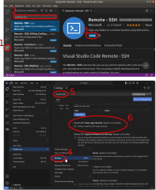

<!-- 
Note for Training Developers:
We provide instructions for commonly-used software as commented sections below.
Uncomment the sections relevant for your materials, and add additional instructions where needed (e.g. specific packages used).
Note that we use tabsets to provide instructions for all three major operating systems.
-->

::: {.callout-tip level=2}
## Workshop Attendees

Please make sure to follow these instructions before attending our workshops.
If you have any issues installing the software please get in touch with us beforehand.
:::


## Software

There are three recommended pieces of software needed to work with the HPC:

- a terminal
- a file transfer software
- a text editor with the ability to edit files on a remote server

This document gives instructions on how to install or access these on different operating systems.


### Unix terminal

::: {.panel-tabset group="os"}
#### Windows

If you are comfortable with installing software on your computer, we highly recommend installing the **Windows Subsystem for Linux** (WSL2), which provides native _Linux_ functionality from within Windows.  
Alternatively, you can install **MobaXterm**, which provides a Unix-like terminal on _Windows_.  
We provide instructions for both.

:::{.panel-tabset}

##### MobaXterm

- Go the the [MobaXterm download page](https://mobaxterm.mobatek.net/download-home-edition.html).
- Download the "_Portable edition_" (blue button). 
  - Unzip the downloaded file and copy the folder to a convenient location, such as your Desktop.
  - You can directly run the program (without need for installation) from the executable in this folder. 

You can access your Windows files from within MobaXterm.
Your `C:\` drive is located in `/drives/C/` (equally, other drives will be available based on their letter). 
For example, your documents will be located in: `/drives/C/Users/<WINDOWS USERNAME>/Documents/`. 
By default, MobaXterm creates shortcuts for your Windows Documents and Desktop.  
It may be convenient to set shortcuts to other commonly-used directories, which you can do using _symbolic links_.
For example, to create a shortcut to Downloads: `ln -s /drives/C/Users/<WINDOWS USERNAME>/Downloads/ ~/Downloads`

##### WSL

There are detailed instructions on how to install WSL on the [Microsoft documentation page](https://learn.microsoft.com/en-us/windows/wsl/install). 
But briefly:

- Click the Windows key and search for  _Windows PowerShell_, right-click on the app and choose **Run as administrator**. 
- Answer "Yes" when it asks if you want the App to make changes on your computer. 
- A terminal will open; run the command: `wsl --install`. 
  - This should start installing "ubuntu". 
  - It may ask for you to restart your computer. 
- After restart, click the Windows key and search for _Ubuntu_, click on the App and it should open a new terminal. 
- Follow the instructions to create a username and password (you can use the same username and password that you have on Windows, or a different one - it's your choice). 
- You should now have access to a Ubuntu Linux terminal. 
  This (mostly) behaves like a regular Ubuntu terminal, and you can install apps using the `sudo apt install` command as usual. 

After WSL is installed, it is useful to create shortcuts to your files on Windows. 
Your `C:\` drive is located in `/mnt/c/` (equally, other drives will be available based on their letter). 
For example, your desktop will be located in: `/mnt/c/Users/<WINDOWS USERNAME>/Desktop/`. 
It may be convenient to set shortcuts to commonly-used directories, which you can do using _symbolic links_, for example: 

- **Documents:** `ln -s /mnt/c/Users/<WINDOWS USERNAME>/Documents/ ~/Documents`
  - If you use OneDrive to save your documents, use: `ln -s /mnt/c/Users/<WINDOWS USERNAME>/OneDrive/Documents/ ~/Documents`
- **Desktop:** `ln -s /mnt/c/Users/<WINDOWS USERNAME>/Desktop/ ~/Desktop`
- **Downloads**: `ln -s /mnt/c/Users/<WINDOWS USERNAME>/Downloads/ ~/Downloads`

:::


#### macOS

Mac OS already has a terminal available.  
Press <kbd><kbd>&#8984;</kbd> + <kbd>space</kbd></kbd> to open _spotlight search_ and type "terminal".

Optionally, if you would like a terminal with more modern features, we recommend installing [_iTerm2_](https://iterm2.com).

#### Linux

Linux distributions already have a terminal available.  
On _Ubuntu_ you can press <kbd><kbd>Ctrl</kbd> + <kbd>Alt</kbd> + <kbd>T</kbd></kbd> to open it.

:::


### Filezilla

::: {.panel-tabset group="os"}

#### Windows

- Go to the [Filezilla Download page](https://filezilla-project.org/download.php?show_all=1) and download the file _FileZilla_3.65.0_win64-setup.exe_ (the latest version might be slightly different). Double-click the downloaded file to install the software, accepting all the default options. 
- After completing the installation, go to your Windows Menu, search for "Filezilla" and launch the application, to test that it was installed successfully. 

#### macOS

- Go to the [Filezilla Download page](https://filezilla-project.org/download.php?show_all=1) and download either the **macOS (Intel)** (for older processors) or **macOS (Apple Silicon)** (for newer M* processors) installers.
- Go to the Downloads folder and double-click the file you just downloaded to extract the application. Drag-and-drop the "Filezilla" file into your "Applications" folder. 
- You can now open the installed application to check that it was installed successfully (the first time you launch the application you will get a warning that this is an application downloaded from the internet - you can go ahead and click "Open").

#### Linux

- _Filezilla_ often comes pre-installed in major Linux distributions such as Ubuntu. Search your applications to check that it is installed already. 
- If it is not, open a terminal and run:
  - Ubuntu: `sudo apt-get update && sudo apt-get install filezilla`
  - CentOS: `sudo yum -y install epel-release && sudo yum -y install filezilla`

:::


### Visual Studio Code (optional)

::: {.panel-tabset group="os"}

#### Windows

- Go to the [Visual Studio Code download page](https://code.visualstudio.com/Download) and download the installer for your operating system. 
  Double-click the downloaded file to install the software, accepting all the default options. 
- After completing the installation, go to your Windows Menu, search for "Visual Studio Code" and launch the application. 
- Go to "_File > Preferences > Settings_", then select "_Text Editor > Files_" on the drop-down menu on the left. Scroll down to the section named "_EOL_" and choose "_\\n_" (this will ensure that the files you edit on Windows are compatible with the Linux operating system).
- Continue by following the instructions "Configuring Visual Studio Code".

#### macOS

- Go to the [Visual Studio Code download page](https://code.visualstudio.com/Download) and download the installer for Mac.
- Go to the Downloads folder and double-click the file you just downloaded to extract the application. Drag-and-drop the "Visual Studio Code" file to your "Applications" folder. 
- You can now open the installed application to check that it was installed successfully (the first time you launch the application you will get a warning that this is an application downloaded from the internet - you can go ahead and click "Open").
- Continue by following the instructions "Configuring Visual Studio Code".

#### Linux

- Go to the [Visual Studio Code download page](https://code.visualstudio.com/Download) and download the installer for your Linux distribution. Install the package using your system's installer.
- Continue by following the instructions in "Configuring Visual Studio Code".

:::


#### Configuring Visual Studio Code

We will use an extension called "Remote-SSH". 
To install the extension (see @fig-vscode-ssh):

1. Click the "Extensions" button on the side bar (or use <kbd>Ctrl + Shift + X</kbd>).
2. In the search box type "remote ssh" and choose the "Remote - SSH" extension.
3. Click the "Install" button in the window that opens.
4. Restart VS Code.
5. Go to <kbd>File</kbd> → <kbd>Preferences</kbd> → <kbd>Settings</kbd>
6. In the search box type "Remote SSH: Show Login Terminal"
7. Tick the option "Always reveal the SSH login terminal"

{#fig-vscode-ssh}


## Data

If you are attending our workshop, then all the data is already provided on our training HPC. 
However, if you want to practice after the course on your HPC, you can download the data and scripts used in the exercises from the links below. 

Note the two versions below are very similar, some SLURM options are different depending on our training environment, but for practicing in your own HPC it won't make a difference, as you will have to change the SLURM options regardless. 

:::{.panel-tabset}
#### Generic

<a href="https://www.dropbox.com/sh/mcu1hjxlr8yqxxa/AAB8s5NcHZH1Tkof4B5JXuyLa?dl=1">
  <button class="btn"><i class="fa fa-download"></i> Download</button>
</a>

Programmatically, you can do: 

```bash
# generic version
wget -O data.zip "https://www.dropbox.com/sh/mcu1hjxlr8yqxxa/AAB8s5NcHZH1Tkof4B5JXuyLa?dl=1"
unzip data.zip -d DIRECTORY_OF_YOUR_CHOICE
```

#### CSD3 

<a href="https://www.dropbox.com/scl/fo/x1ery8kni952gz450jt3z/ADbTA_FLJxPejtY30QLf1G4?rlkey=dq2sah0gknmdfx9dp1nvdzd51&dl=0">
  <button class="btn"><i class="fa fa-download"></i> Download</button>
</a>

Programmatically, you can do: 

```bash
# CSD3 version
wget -O data.zip "https://www.dropbox.com/scl/fo/x1ery8kni952gz450jt3z/ADbTA_FLJxPejtY30QLf1G4?rlkey=dq2sah0gknmdfx9dp1nvdzd51&dl=1"
unzip data.zip -d ~/rds/hpc-work/
```

:::